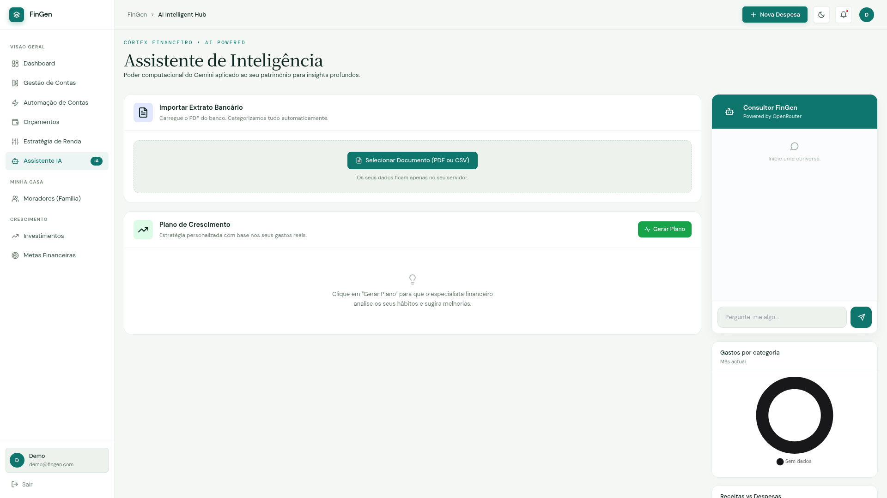
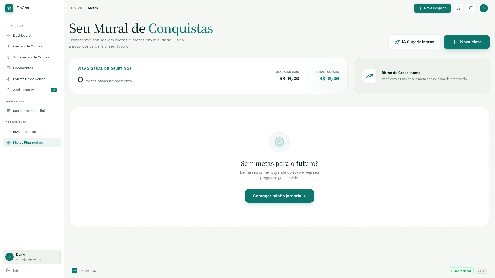
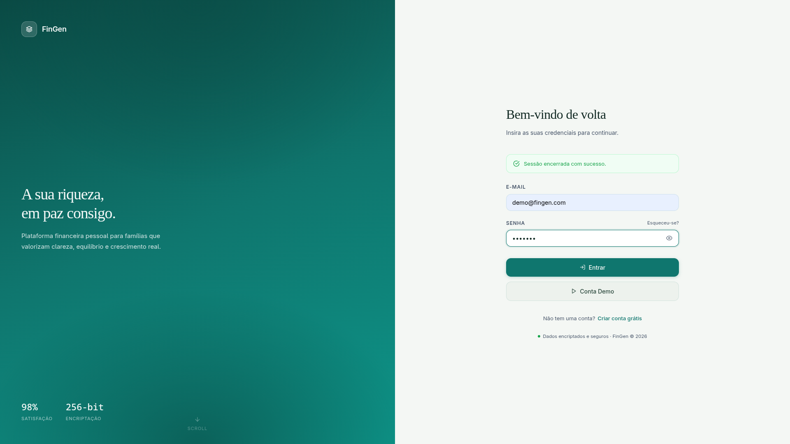
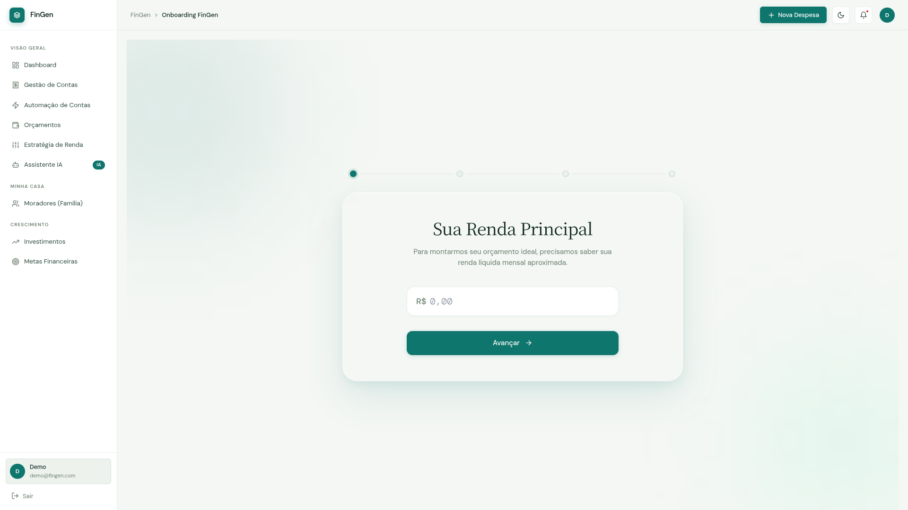

# 💸 FinGen — Intelligent Financial Management

> A comprehensive web platform for domestic and personal financial control, featuring integrated AI, wealth management, and automated budgeting.

[](https://fingen-app.onrender.com)
[](https://github.com/lucachak/FinGen)
[](https://openjdk.org/projects/jdk/21/)
[](https://spring.io/projects/spring-boot)
[](https://www.docker.com/)

---

<p align="center">
  
</p>
<p align="center">
  
  
</p>
<p align="center">
  
</p>

---

## 📖 About the Project

**FinGen** is a full-stack web application developed to simplify and centralize family and personal financial management. It combines a robust Spring Boot backend with a reactive frontend via HTMX and Thymeleaf, offering a fluid experience without the complexity of a separate SPA.

The platform goes beyond simple expense tracking: it integrates **generative AI** (Google Gemini + OpenRouter) for bank statement analysis, budget goal suggestions, and personalized financial coaching, plus a complete **wealth management** module for tracking assets (real estate, stocks, vehicles, passive income).

---

## ✨ Key Features

### 💳 Financial Management (Core Module)
- **Accounts Payable/Receivable** — Complete tracking of income and expenses with categories, priorities, and attachments.
- **Transaction Scopes** — Separate tracking by scope: `HOUSE`, `PERSONAL`, and `BUSINESS`.
- **Quick Pay** — Mark an account as paid with one click, without opening a form.
- **Recurring Transactions** — Automation for monthly/weekly/annual expenses via recurrence groups.
- **Transaction History** — Full listing with status filters (overdue, upcoming, paid).

### 📊 Centralized Dashboard
- **Monthly KPI Cards** — Home, Personal, and Business spending with highlighted pending amounts.
- **Free Cash Flow** — Real-time calculation: Revenue − (Actual Expenses + Pending).
- **Doughnut Chart** — Monthly household spending distribution by category.
- **Wealth History** — Line chart showing net worth evolution (up to 12 months).
- **Budget Alerts** — Automatic notifications when 80%+ of a category limit is reached.
- **Active Goals** — Visual progress of ongoing financial goals.
- **Upcoming Bills** — List of the next pending expenses.
- **Recent Transactions** — Last 5 paid transactions.
- **AI Suggestions** — Automatically generated insights based on your wealth snapshot.

### 🤖 Artificial Intelligence (Dual Stack)
| Service | Function |
|---------|--------|
| **Google Gemini** | Bank statement processing (PDF/Image), expense anomaly analysis, personalized investment planning. |
| **OpenRouter** | Conversational financial chat, goal suggestions based on user profile. |

**Statement Import Workflow:**
1. Upload bank statement PDF/Image.
2. Gemini automatically extracts and classifies transactions.
3. User reviews, edits, and confirms transactions in staging.
4. Confirmed transactions are saved to the database.

### 🏦 Wealth Management (Wealth Module)
- **Supported Asset Types:**
  - `BankAccountAsset` — Bank accounts and cash.
  - `StockAsset` — Stocks and investment funds (with market price sync).
  - `RealEstateAsset` — Real estate.
  - `VehicleAsset` — Vehicles.
  - `IncomeAsset` — Monthly passive income.
- **Wealth Snapshot** — Instant total net worth view with breakdown by asset type.
- **Wealth Evolution** — Net worth growth tracking over time.
- **Automated AI Suggestions** — Generated for every snapshot based on asset composition.

### 🎯 Financial Goals
- Manual goal creation with type, target value, deadline, and progress tracking.
- **Goal Types:** `TRAVEL`, `CAR`, `HOUSE`, `RETIREMENT`, `EMERGENCY_FUND`, `EDUCATION`, `OTHER`.
- Automatic calculation of required monthly savings to reach the goal on time.
- **AI Goal Suggestions** — OpenRouter suggests goals based on the user's financial profile.
- **One-Click AI Goal Creation** — Convert suggestions into saved goals instantly.

### 📈 Investments
- Portfolio tracking with invested vs. current value.
- **Asset Types:** Treasury, CD, Stocks, REITs, Funds, Crypto, Savings, Others.
- Total portfolio ROI calculation.
- **Price Sync** — Automatic market price updates via `MercadoService`.

### 📋 Category Budgets
- Monthly spending limit definition per category.
- Real-time monitoring of consumption vs. limit (%).
- **Risk Status:** `NORMAL` (< 80%), `WARNING` (80–99%), `CRITICAL` (≥ 100%).
- **Auto-Generation** — Create budgets based on the average spending of the last 3 months (+10% margin).

### 🏠 Member Management
- Support for multiple users within the same household.
- Expense splitting among residents.
- Profile picture uploads.
- Activation/Deactivation control (soft delete to preserve history).

### 📝 Categories
- Full CRUD for transaction categories.
- Category natures for accounting organization.

### 📊 Reports
- Financial reporting module (`/app/financeiro/relatorios`).

### 🚀 Onboarding
- Guided initial setup of the financial profile.
- Collection of: financial profile, budgeting strategy, savings goal, and essential spending cap.
- Financial distribution setup with support for multiple strategies (`EstrategiaDistribuicao`).
- Redirects to the dashboard only after setup completion.

---

## 🗺️ Route Map

| Method | Route | Description |
|--------|------|-----------|
| `GET` | `/` | Home page (redirects to `/app/dashboard`) |
| `GET` | `/auth/login` | Login page |
| `GET/POST` | `/auth/register` | New user registration |
| **Dashboard** | | |
| `GET` | `/app/dashboard` | Main dashboard |
| `GET` | `/app/dashboard/chart-data` | JSON data for charts (HTMX) |
| **Bills** | | |
| `GET` | `/app/financeiro/contas` | Pending bills list and history |
| `GET` | `/app/financeiro/contas/nova` | New bill form |
| `GET` | `/app/financeiro/contas/editar/{id}` | Edit bill |
| `POST` | `/app/financeiro/contas/salvar` | Save bill (with attachment upload) |
| `POST` | `/app/financeiro/contas/pagar/{id}` | Quick payment |
| `POST` | `/app/financeiro/contas/excluir/{id}` | Delete bill |
| `POST` | `/app/financeiro/contas/salvar-lote` | Batch import (via AI) |
| **Recurring Transactions** | | |
| `GET` | `/app/financeiro/recorrentes` | Automation list |
| `GET` | `/app/financeiro/recorrentes/nova` | New automation |
| `GET` | `/app/financeiro/recorrentes/editar/{id}` | Edit automation |
| `POST` | `/app/financeiro/recorrentes/salvar` | Save automation |
| `POST` | `/app/financeiro/recorrentes/excluir/{id}` | Delete automation |
| **Goals** | | |
| `GET` | `/app/financeiro/metas` | Goals list |
| `GET` | `/app/financeiro/metas/novo` | New goal |
| `GET` | `/app/financeiro/metas/editar/{id}` | Edit goal |
| `POST` | `/app/financeiro/metas/salvar` | Save goal |
| `POST` | `/app/financeiro/metas/excluir/{id}` | Delete goal |
| `POST` | `/app/financeiro/metas/ai-suggest` | AI goal suggestions (JSON) |
| `POST` | `/app/financeiro/metas/ai-criar` | Create goal from AI suggestion |
| **Budgets** | | |
| `GET` | `/app/financeiro/orcamentos` | Budget list by category |
| `GET` | `/app/financeiro/orcamentos/novo` | New budget |
| `GET` | `/app/financeiro/orcamentos/editar/{id}` | Edit budget |
| `POST` | `/app/financeiro/orcamentos/salvar` | Save budget |
| `POST` | `/app/financeiro/orcamentos/excluir/{id}` | Delete budget |
| `POST` | `/app/financeiro/orcamentos/gerar-automatico` | Generate budgets automatically |
| **Reports** | | |
| `GET` | `/app/financeiro/relatorios` | Financial reports |
| **Investments** | | |
| `GET` | `/app/wealth/investimentos` | Investment portfolio |
| `GET` | `/app/wealth/investimentos/novo` | New investment |
| `GET` | `/app/wealth/investimentos/editar/{id}` | Edit investment |
| `POST` | `/app/wealth/investimentos/salvar` | Save investment |
| `POST` | `/app/wealth/investimentos/excluir/{id}` | Delete investment |
| `POST` | `/app/wealth/investimentos/sync` | Sync market prices |
| **AI (Assistant)** | | |
| `GET` | `/app/ia` | AI Assistant interface |
| `GET` | `/app/ia/revisar` | Review imported statement |
| `POST` | `/api/ia/chat` | AI Chat (OpenRouter) |
| `POST` | `/api/ia/upload-extrato` | Upload statement for processing |
| `POST` | `/api/ia/confirmar` | Confirm transaction import |
| `GET` | `/api/ia/consultor-pessoal` | Personalized investment plan |
| `GET` | `/api/ia/analisar-anomalias` | Anomaly analysis (HTMX fragment) |
| `GET` | `/api/ia/status` | AI service status |
| **Settings** | | |
| `GET` | `/app/settings/moradores` | Member list |
| `GET` | `/app/settings/moradores/novo` | Add member |
| `GET` | `/app/settings/moradores/editar/{id}` | Edit member |
| `POST` | `/app/settings/moradores/salvar` | Save member |
| `POST` | `/app/settings/moradores/remover/{id}` | Deactivate member |
| **Categories** | | |
| `GET` | `/app/categorias` | Category list |
| **Wealth API (REST)** | | |
| `GET` | `/api/v1/wealth/summary` | Wealth summary (JSON) |
| `GET` | `/api/v1/wealth/history` | Snapshot history (JSON) |
| `POST` | `/api/v1/wealth/assets` | Add asset (JSON) |
| **Onboarding** | | |
| `GET/POST` | `/app/onboarding` | Initial profile setup |
| `GET/POST` | `/app/setup/distribuicao` | Distribution strategy setup |

---

## 🏗️ Architecture

```
FinGen
├── Java Backend (Spring Boot)          → Port 8080
│   ├── Web Layer (Controllers + Thymeleaf/HTMX)
│   ├── Service Layer (Business Logic)
│   ├── Repository Layer (Spring Data JPA)
│   └── Security Layer (Spring Security + JWT)
│
├── Python IA Service (FastAPI)         → Port 8000
│   └── Gemini API integration (statement processing)
│
└── Database
    ├── Supabase (Production/Cloud - PostgreSQL)
    └── PostgreSQL (Local Development via Docker)
```

### Java Package Structure

```
lucas.basemodel/
├── BaseModelApplication.java          # Entry point
├── core/
│   ├── config/                        # Spring configuration beans
│   ├── exceptions/                    # Global exception handlers
│   ├── mail/                          # E-mail service
│   ├── security/                      # Spring Security config + JWT
│   └── storage/                       # File storage service
├── modules/
│   ├── auth/                          # Auth module (login, registration)
│   ├── financeiro/
│   │   ├── controllers/               # Onboarding & setup controllers
│   │   ├── dto/                       # Data Transfer Objects
│   │   ├── enums/                     # Enumerable domain
│   │   ├── models/                    # JPA Entities
│   │   ├── repositories/              # Spring Data repos
│   │   └── services/                  # Business logic
│   ├── user/                          # User entity + repository
│   └── wealth/
│       ├── controllers/               # Wealth API REST
│       ├── dto/
│       ├── enums/
│       ├── models/                    # Asset types + WealthSnapshot
│       ├── repositories/
│       └── services/
└── web/                               # MVC Controllers (UI)
    ├── dto/                           # View-specific DTOs
    ├── AIViewController.java
    ├── AiController.java
    ├── CategoriaController.java
    ├── ContaController.java
    ├── DashboardController.java
    ├── HomeController.java
    ├── InvestimentoController.java
    ├── MetaController.java
    ├── MoradorController.java
    ├── OrcamentoController.java
    ├── RelatorioController.java
    ├── TransacaoController.java
    └── TransacaoRecorrenteController.java
```

---

## 🛠️ Technology Stack

| Layer | Technology | Version |
|--------|------------|--------|
| **Runtime** | Java (OpenJDK) | 21 |
| **Framework** | Spring Boot | 3.3.0 |
| **Persistence** | Spring Data JPA + Hibernate | — |
| **Database (Dev)** | PostgreSQL | 15 |
| **Database (Prod)** | Supabase (PostgreSQL) | — |
| **Templates** | Thymeleaf + Spring Security 6 Extras | — |
| **Reactivity** | HTMX (htmx-spring-boot-thymeleaf) | 3.6.0 |
| **Security** | Spring Security + JWT (JJWT) | 0.11.5 |
| **Utilities** | Lombok | 1.18.36 |
| **Build** | Maven Wrapper (mvnw) | 3.9.6 |
| **Container** | Docker (multi-stage build) | — |
| **AI (Java)** | Google Gemini API (via GeminiService) | — |
| **AI (Chat)** | OpenRouter API (via OpenRouterService) | — |
| **AI (Python)** | FastAPI + Google Gemini | — |
| **Deploy** | Render.com | — |

---

## 🚀 How to Run Locally

### Prerequisites
- [Docker](https://www.docker.com/) and [Docker Compose](https://docs.docker.com/compose/) installed.
- *Alternative without Docker:* Java 21, Maven 3.9+.

### 1. Clone the repository
```bash
git clone https://github.com/lucachak/FinGen.git
cd FinGen
```

### 2. Configure environment variables
Create a `.env` file in the project root:

```env
# Database (Supabase - IPv4 Pooler)
SUPABASE_DB_URL=jdbc:postgresql://[pooler-host]:6543/postgres?prepareThreshold=0&ssl=true&sslmode=require
SUPABASE_DB_USER=postgres.[project-id]
SUPABASE_DB_PASS=your_db_password

# AI Integration
GEMINI_TOKEN=your_gemini_token
OPENROUTER_API_KEY=your_openrouter_api_key
PYTHON_API_URL=http://python-ia:8000

# File Upload
SPRING_SERVLET_MULTIPART_MAX_FILE_SIZE=10MB
SPRING_SERVLET_MULTIPART_MAX_REQUEST_SIZE=10MB
```

> ⚠️ **Never commit the `.env` file** — it is already in `.gitignore`.

### 3. Start the containers
```bash
docker-compose up --build
```

The application will be available at: **http://localhost:8080**

### 4. (Optional) Run without Docker

```bash
# Only the database and Python service via Docker
docker-compose up db python-ia -d

# Compile and run Java locally
./mvnw spring-boot:run
```

---

## 🌐 Production Deployment (Render)

The project uses a `render.yaml` file for automatic deployment on [Render.com](https://render.com/).

### Configured Services:
| Service | Type | Dockerfile |
|---------|------|------------|
| `fingen-java` | Web Service | `./Dockerfile` |
| `fingen-ia` | Web Service | `./Dockerfile.python` |

### Required Environment Variables on Render Panel:
| Variable | Description |
|----------|-----------|
| `OPENROUTER_API_KEY` | OpenRouter API Key for AI chat. |
| `GEMINI_TOKEN` | Google Gemini API Token. |
| `DB_URL` | Supabase Database URL (JDBC). |
| `DB_USERNAME` | Supabase Pooler Username. |
| `DB_PASSWORD` | Supabase Database Password. |
| `PYTHON_API_URL` | Internal URL of the Python IA service. |

> 💡 The production database was migrated from H2 to **Supabase (PostgreSQL)**, ensuring real persistence and cloud scalability.

---

## 🗄️ Main Data Model

### Core Entities

**`Conta` (Bill)** — Central unit of financial transactions
| Field | Type | Description |
|-------|------|-----------|
| `id` | `Long` | Autoincremental PK |
| `descricao` | `String` | Transaction description |
| `valor` | `BigDecimal` | Transaction value |
| `tipo` | `TipoTransacao` | `REVENUE` or `EXPENSE` |
| `escopo` | `EscopoTransacao` | `HOUSE`, `PERSONAL`, `BUSINESS` |
| `prioridade` | `Prioridade` | `HIGH`, `MEDIUM`, `LOW` |
| `frequencia` | `Frequencia` | `ONCE`, `MONTHLY`, `WEEKLY`, `ANNUAL`, etc. |
| `status` | `StatusTransacao` | `PENDING`, `PAID`, `OVERDUE` |
| `paga` | `boolean` | Payment flag |
| `dataVencimento` | `LocalDate` | Due date |
| `dataPagamento` | `LocalDate` | Effective payment date |
| `categoria` | `Categoria` (FK) | Transaction category |
| `responsavel` | `User` (FK) | Responsible user |
| `asset` | `Asset` (FK) | Associated asset (optional) |
| `comprovante` | `String` | Path to the attachment file |

**`User`** — User/Member Profile
| Field | Type | Description |
|-------|------|-----------|
| `id` | `UUID` | Generated PK |
| `email` | `String` | Unique email (login) |
| `username` | `String` | Unique username |
| `orcamentoMensal` | `BigDecimal` | Monthly budget (default: 3500.00) |
| `tipoPerfilFinanceiro` | `String` | Risk profile (`CONSERVATIVE`, etc.) |
| `budgetingStrategy` | `WealthStrategy` | Budgeting strategy |
| `metaPoupancaMensal` | `BigDecimal` | % of income to save (default: 20%) |
| `tetoGastosEssenciais` | `BigDecimal` | % cap for essential spending (default: 50%) |
| `setupCompleted` | `boolean` | Onboarding completion flag |

---

## 🔐 Security

- **Database Encryption (AES-256):** Sensitive columns are encrypted at rest in the database using JPA Attribute Converters:
  - *Randomized Encryption (Unique IV per record):* Applied to user full names (`nomeCompleto`), phone numbers (`telefone`), bank names (`bankName`), home addresses (`address`), stock brokerages (`broker`), and asset descriptions (`description`).
  - *Deterministic Encryption (Fixed IV per key):* Applied to transaction descriptions (`descricao`), goals titles (`titulo`), and stock tickers (`ticker`) to support database exact-match queries.
  - *Key Management:* Derived securely from the `DB_ENCRYPTION_KEY` environment variable.
- **HTTP Security Headers (CSP & HSTS):**
  - *Content Security Policy (CSP):* Strict policy blocks unauthorized script execution, only whitelisting scripts/styles from trusted local endpoints and standard UI CDNs (`unpkg.com`, `tailwindcss.com`, `gsap`, `lucide`).
  - *Strict Transport Security (HSTS):* Enforces SSL/HTTPS browser connections for all traffic.
- **Authentication & Authorization:** Spring Security with form-based session + JWT support. All `/app/**` routes require authentication and isolate data by user.
- **Passwords:** Hashed with `PasswordEncoder` (BCrypt).
- **Secure File Uploads:**
  - Receipts are saved with random UUIDs and filenames are sanitized to prevent directory traversal.
  - Profile pictures are validated against whitelisted extensions (`.jpg`, `.jpeg`, `.png`, `.gif`, `.webp`) to prevent Remote Code Execution (RCE) via scripting files.
- **Session & Cookie Security:** Session cookies (`JSESSIONID` and `jwtData`) are configured with `HttpOnly`, `Secure` (production), and `SameSite=Lax` to mitigate XSS-based token theft and CSRF.
- **Soft Delete:** Members are deactivated (`ativo = false`) instead of deleted to preserve history.
- **Session Staging:** In-memory cache (`ConcurrentHashMap`) for statement staging to avoid HTTP session bloat.

---

## 🧪 Testing

```bash
# Run all tests
./mvnw test

# Run with coverage report
./mvnw verify
```

---

## 📁 Important File Structure

```
FinGen/
├── src/
│   ├── main/
│   │   ├── java/lucas/basemodel/     # Java Source Code
│   │   └── resources/
│   │       ├── templates/            # Thymeleaf Templates
│   │       │   ├── auth/             # Login & Register
│   │       │   ├── dashboard/        # Main Dashboard
│   │       │   ├── contas/           # Bill Management
│   │       │   ├── metas/            # Financial Goals
│   │       │   ├── orcamentos/       # Category Budgets
│   │       │   ├── investimentos/    # Investment Portfolio
│   │       │   ├── recorrentes/      # Recurring Transactions
│   │       │   ├── moradores/        # Member Management
│   │       │   ├── ia/               # AI Assistant Interface
│   │       │   ├── wealth/           # Wealth Management
│   │       │   ├── relatorios/       # Reports
│   │       │   └── layout/           # Base Layout (layout.html)
│   │       ├── static/               # CSS, JS, Images
│   │       └── application.properties
│   └── test/                         # Automated Tests
├── main.py                           # Python Service (Gemini AI)
├── requirements.txt                  # Python Dependencies
├── Dockerfile                        # Java Service Build
├── Dockerfile.python                 # Python IA Service Build
├── docker-compose.yml                # Local Orchestration (Java + Python + PostgreSQL)
├── render.yaml                       # Production Deploy (Render.com)
├── pom.xml                           # Maven Dependencies
└── .env                              # Environment Variables (not versioned)
```

---

## 🤝 Contributing

1. Fork the repository.
2. Create a branch for your feature: `git checkout -b feature/my-feature`.
3. Commit your changes: `git commit -m 'feat: add new feature'`.
4. Push to the branch: `git push origin feature/my-feature`.
5. Open a Pull Request.

---

## 📄 License

This project is licensed under the MIT License. See the `LICENSE` file for more details.

---

<div align="center">
  Made with ☕ and Java by <a href="https://github.com/lucachak">Lucas Lucachak</a>
</div>